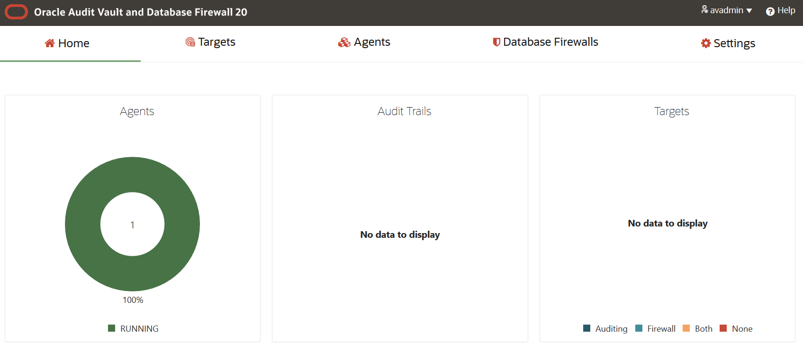
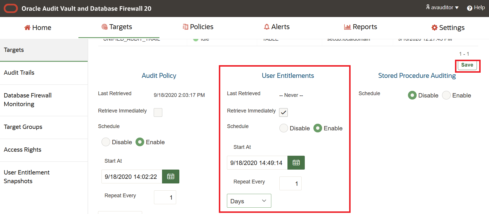

# Lab 8 - Audit Vault #

This lab will demonstrate how to use Audit Vault to manage the audit data produced by an Oracle database.

## Disclaimer ##
The following is intended to outline our general product direction. It is intended for information purposes only, and may not be incorporated into any contract. It is not a commitment to deliver any material, code, or functionality, and should not be relied upon in making purchasing decisions. The development, release, and timing of any features or functionality described for Oracle’s products remains at the sole discretion of Oracle.

## Requirements ##

Instructions in this lab expect that you have completed all the previous labs in the workshop.

## Introduction  ##

A large deployment of Oracle (or non-Oracle) databases can produce a great amount of audit data to consolidate and manage over time. In addition to audit data from databases, other systems such operating systems and file systems produce audit trails that can be used to analyze events relevant to security.

Good practice dictates that audit data should be transmitted to a remote centralized location where it is secure from tampering by the individuals whose activities are being audited.

This is also recommended by DBSAT findings such as the following one:


The Audit Vault Server solves these problems by collecting and consolidating audit data, providing comprehensive reports and alerts for forensic and compliance purposes and managing its retention over time.

In this lab, an Audit Vault Server has already been provisioned in virtual machine **av**. We will register **secdb** as a Secure Target, deploy the **Audit Vault agent** to **secdb** and configure Audit Trails to collect audit data from **secdb**.

## Step 1 : Registering host and deploying the agent ##

First thing to do is to register secdb as a secure target and deploy the agent.

From the **VNC connection to secdb**, start Firefox and connect to the Audit Vault as Super Administrator:

*	URL : **https://av**
*	Username	: **AVADMIN**
*	Password	: **T06tron.** (in this password 06 are digits and the last character is a dot)

Allow a security exception as we are just using a self-signed certificate.


In Audit Vault console, go to the **Agents** tab and click **Register** to register secdb as a secure target host. Enter the following values then click on **Add**.

*	Host name		: **secdb.localdomain**
*	Host IP			: **10.0.0.2**


Click on **Save** at the bottom of the dialog box.


Make note of the automatically generated **Agent Activation Key** (e.g. copy and paste it to **Gedit**)


Now click on **Agent Software** on the left hand side and download Audit Vault  agent.


Save **agent.jar** to ``/home/oracle/HOL/lab08_av``


We can now configure and start the agent.

````
$ <copy>cd /home/oracle/HOL/lab08_av</copy>
````

````
$ <copy>java -jar agent.jar -d /u01/oracle/avagent</copy>

[oracle@secdb lab08_av]$ java -jar agent.jar -d /u01/oracle/avagent
Checking for updates...
Agent is updating. This operation may take a few minutes. Please wait...
Agent updated successfully.
Agent installed successfully.
If deploying hostmonitor please refer to product documentation for additional installation steps.
````

````
$ <copy>cd /u01/oracle/avagent/bin</copy>
````

Run the following statement to enter the **Agent Activation Key** previously generated.

````
$ <copy>./agentctl start -k</copy>

[oracle@secdb lab08_av]$ cd /u01/oracle/avagent/bin
[oracle@secdb bin]$ ./agentctl start -k
Enter Activation Key:
Agent started successfully.
````

The Audit Vault agent should now be running.

````
$ <copy>./agentctl status</copy>

[oracle@secdb bin]$ agentctl status
Agent is running.
````

## Step 2 : Configuring Audit Trails ##

Now that the agent has been installed and started on **secdb**, it is possible to connect to Audit Vault from a local browser on your workstation.

You can connect to the Audit Vault Server console using its public IP at the following URL:

**https://&lt AV PUBLIC IP &gt**

* User Name : **AVADMIN**
* Password  : **T06tron.** (do not forget the last dot!)



We can now register secure targets and create audit trails.

From Audit Vault Server console, go to **Targets** and click on  **Register** to create a secure target:


Create a secure target for the Container Database **cont** and another one for the Pluggable Database **pdb1** with the following **Audit Connect Details**:

*	New Secured Target Name: **cont**
*	Description: **Container database**
*	Secured Target Type: **Database**
*	Host name: **secdb**
*	Port: **1521**
*	Service Name: **cont**
*	Username: **system**
*	Password: **MyDbPwd#1**

Click on **Save**.

*	New Secured Target Name: **pdb1**
*	Description: **Pluggable database**
*	Secured Target Type: **Database**
*	Host name: **secdb**
*	Port: **1521**
*	Service Name: **pdb1**
*	Username: **system**
*	Password: **MyDbPwd#1**

Click on **Save**.

We should now have configured two targets:


Let’s collect audit data created inside these two databases. First click on target **cont** and add a first audit trail (in the **Audit Data Collection** section):


*Audit data stored in the Container database (unified audit):*

*	audit trail type: **TABLE**
*	collection host: **secdb.localdomain**
*	secured target: **cont**
*	trail location: **UNIFIED\_AUDIT\_TRAIL**
*	collection plugin: **com.oracle.av.plugin.oracle**


Now let's add to **cont** a second audit trail to collect data from operating system files (as per parameter audit\_file\_dest = /u01/oracle/admin/CONT/adump).

Click again on **Add** in the **Audit Data Collection** section and enter the following details:

*Audit data stored outside the database:*

*	audit trail type: **DIRECTORY**
*	collection host: **secdb.localdomain**
*	secured target: **cont**
*	trail location: **/u01/oracle/db/admin/CONT/adump**
*	collection plugin: **com.oracle.av.plugin.oracle**

The collection should start automatically after a few seconds. The Collection Status shows the agent starting, collecting then being idle:


Similarly, add to target **pdb1** an audit trail with the following details.

*Audit data stored in the Pluggable database:*

*	audit trail type: **TABLE**
*	collection host: **secdb.localdomain**
*	secured target: **pdb1**
*	trail location: **UNIFIED\_AUDIT\_TRAIL**
*	collection plugin: **com.oracle.av.plugin.oracle**


## Step 3 : Configuring Audit Policies ##

Audit Vault allows you to retrieve, view and modify your audit policies. Let's do it for pdb1.

To do so, logout from AVADMIN and login as AVAUDITOR using the following credentials:

*	Username	: **AVAUDITOR**
*	Password	: **T06tron.**

The console displays AVAUDITOR's dashboard.

As AVAUDITOR, go to **Targets**, click on **pdb1** and then on **Retrieve Immediately** in the **Audit Policy** section. Also enable to refresh this every day as show below.


Click on **Settings** and **Jobs** to view the status of the retrieve job.


To verify pdb1's audit policies, go to **Policies** and click on **pdb1**.


WE can decide to modify this by adding more policies and clicking on **Provision Unified Policy**.


## Step 4 : Using Audit Vault Reporting ##

The Oracle Audit Vault Server provides powerful built-in reports to monitor a wide range of activities, including privileged user activity and changes to database structures. The reports provide visibility into activities and provide detailed information regarding the who, what, when and where of database access.

Let's generate new audit records by executing the following script which will create a number of violations that will be audited.

````
$ <copy>cd /home/oracle/HOL/lab08_av</copy>
````

````
$ <copy>av_createrecords.sh</copy>

[oracle@secdb lab08_av]$ av_createrecords.sh

(...)

SQL> delete from hr.regions;
delete from hr.regions
               *
ERROR at line 1:
ORA-01031: insufficient privileges
````


To view reports on the activity we have just generated, click on the **Reports** tab and **Activity Reports** .

Select the **Data Access** report within the **Data Access & Modification** section.  View the report by clicking on its name and verify that you see audit records that were collected on today’s date.


You can view failed Logins in the **Failed Login Events** report of the **Login & Logout Events** section:


And Database Vault realms violations in the **Database Vault Activitys** report of the **DB Vault Activity** section:


View all details of an audit record by clicking on the left hand side icon.


Various filters can be used to focus each report.

Add a new filter by clicking on **Actions** > **Filter** and selecting the secure target **pdb1**. For example:

## Step 5 : User Entitlements Reporting ##

Audit Vault can also be used to retrieve and display **user entitlements** (ie granted privileges and roles).

First, retrieve user entitlement data for **pdb1**.

As AVAUDITOR, go to **Targets**, click on **pdb1** and then on **Retrieve Immediately** in the **User Entitlements** section. Also enable to refresh this every day as show below.



Click on **Settings** and **Jobs** to view the status of the retrieve job.

View the **Entitlements** report of the **Database settings** section:


The reports in **Activity Reports** > **Entitlements Reports** allow to take multiple snapshots of user entitlement data and compare different snapshots to see how the data has changed over time, as it is generally be more useful to report on what has **changed** over a specific period.

## Step 6 : Compliance Reports ##

The reports shown here are intended to help you meet your compliance reporting requirements as quickly as possible, across **GDPR**, **PCI**, **Sarbanes-Oxley**, **HIPAA** (healthcare-related) and other areas.  In order to generate compliance reports for a secured target, you must add it to a compliance report group.

Let us start by adding our secure target **pdb1** as member of a compliance group (e.g. **Payment Card Industry**).

Click on the **Compliance Reports** menu and open the **Payment Card Industry (PCI) Reports** category.  Click the **Go** button, as shown in the figure below.


Select **pdb1**, click on **Add** and **save** the change.


We can now review some reports.  Click for example on the **All Activity (PCI)** link under the **Payment Card Industry (PCI)** Reports section.


Select the **Database Schema Changes** report in the **PCI** section, but this time we will schedule the report so we can create a PDF version of a report, which can then be sent to people who require it.


You can schedule a report to run immediately or on a regular basis.
Click on Schedule to run this job immediately (accept all the default settings).

Once the report has been generated (click on the **Jobs** link in **Settings**), you can save it or open it.


## Step 7 : Capturing All Activity ##

One advantage of Unified Auditing is that all database activities are captured in the same audit trail, including **SQL*Loader Direct Mode** or **Data Pump**.

Let us verify that **UNIFIED\_AUDIT\_TRAIL** does capture **DATA PUMP** activity.

In a default **Database Vault** environment, **SYSTEM** loses the **BECOME USER** privilege, which is required to run Data Pump jobs.

We will first give back this privilege to SYSTEM. Please note that this change would not be sufficient to run Data Pump as SYSTEM on realm-protected data.

Run the following scripts from a terminal window to the secdb server.

````
$ <copy>cd /home/oracle/HOL/lab08_av/dp</copy>
````

````
$ <copy>dp00_grant_become_user.sh</copy>

SQL*Plus: Release 19.0.0.0.0 - Production on Tue Apr 28 12:55:08 2020
Version 19.6.0.0.0
Connected.

SQL> alter session set container=PDB1;
Session altered.

SQL> grant become user to system;
Grant succeeded.
````

Create a DIRECTORY object.

````
$ <copy>sqlplus /nolog</copy>
````


````
$ <copy>@dp10_data_dir.sql</copy>

SQL*Plus: Release 19.0.0.0.0 - Production on Tue Apr 28 12:55:08 2020
Version 19.6.0.0.0
Connected.
SQL> alter session set container=pdb1;
Session altered.

SQL> create or replace directory data_dir as '/home/oracle/HOL/lab08_av/dp';
Directory created.

SQL> grant read, write on directory data_dir to system;
Grant succeeded.
````

We can now run a Data Pump import of the SCOTT schema as SYSTEM:


````
$ <copy>dp20_import.sh</copy>

[oracle@secdb dp]$ dp20_import.sh

(...)
Starting "SYSTEM"."SYS_IMPORT_SCHEMA_01":  system/********@secdb/pdb1 parfile=dp20_import.ini
Processing object type SCHEMA_EXPORT/PRE_SCHEMA/PROCACT_SCHEMA
Processing object type SCHEMA_EXPORT/TABLE/TABLE
Processing object type SCHEMA_EXPORT/TABLE/TABLE_DATA
. . imported "SCOTT"."EMP"                               8.773 KB      14 rows
. . imported "SCOTT"."DEPT"                              6.023 KB       4 rows
. . imported "SCOTT"."SALGRADE"                          5.953 KB       5 rows
. . imported "SCOTT"."BONUS"                                 0 KB       0 rows
Processing object type SCHEMA_EXPORT/TABLE/CONSTRAINT/CONSTRAINT
Processing object type SCHEMA_EXPORT/TABLE/CONSTRAINT/REF_CONSTRAINT
Processing object type SCHEMA_EXPORT/POST_SCHEMA/PROCACT_SCHEMA
Job "SYSTEM"."SYS_IMPORT_SCHEMA_01" successfully completed at Tue (...)
````

Select the **Data Schema Changes** report in the **Built-in Reports** section and filter information on **PDB1**.

You should see that the Data Pump job has been successfully captured.


## Step 8 : Data Privacy Reports ##

DBSAT Discoverer CSV output can be uploaded in order to run Data Privacy reports from Audit Vault.

We will start by loading DBSAT Discoverer’s report into Audit Vault.

From the desktop connection to **secdb** (using **VNC**):

*	Login to Audit Vault as **AVADMIN/T06tron.**
*	Go to **Targets**
*	Click on **pdb1** to show the details page
*	Click on **Sensitive Objects**


* Browse to /home/oracle/HOL/lab01\_dbsat/dbsat/install/pdb1sensitivedata_discover.csv
*	Upload the csv file
*	Do not forget to **Save** your changes!


We can now add **PDB1** to the **Data Privacy compliance** report
group and view **Data Privacy** reports.

*	Login to Audit Vault Server as **AVAUDITOR** / **T06tron.**
*	Go to **Reports** > **Compliance Reports**
*	Click on the **Go** button for **Data Privacy Report (GDPR)**
* Select Secured Target **pdb1** and click **Add** and **Save**.


We can finally review the built-in Data Privacy report in **Reports** > **Compliance Reports** > **Sensitive data**.


## Step 9 : Audit Vault Alerting ##

After monitoring and collecting database activity your organization may want to be alerted when certain activities occur.  It is possible to identify high-risk activities that the security team needs to be made aware of.  These may include account management and database structural changes.  The alerts will let the security team know when there has been activity in these areas.

During this lab you will:

1. Modify the email template for Audit Vault Alerts
2. Add a new Audit Vault Alert Status
3. Create an Audit Vault Alert with the Web Interface
4. Test that the alert is functioning
5. View the near real-time nature of alert functionality

We'll start by modifying the email template for Audit Vault Alerts.

Log into the Audit Vault console as **AVAUDITOR**.

Select the **Settings** / **Email Templates** page and click on **Alert Notification Template** to edit the template.   

Add the **#AlertStatus#** field into the email subject, as shown in the screen below.  Click the **Save** button once completed.


We can also add a new Audit Vault **Alert Status**.

Navigate to the **Alerts** tab, then to the **Manage Alert Status** page.  You will see that there are two pre-configured Alert status values.  


These values are used to maintain a status for each alert that is created in Audit Vault.  You can then manage alerts according to your business requirements.   

We will be adding a new status to record that we are reviewing a given alert.  

Click on the **Create** button. Now add a new Alert Status:

* Status Value: **Reviewing**
* Description: **Alert being reviewed**


We will now create a new alert in Audit Vault. This alert will let us know when a new table has been created. Click on **Policies** > **Alert Policies**.  Click on the **Create** button.

* Name: **CREATE_TABLE**
* Secured Target Type: **Oracle Database**
* Alert Severity: **Critical**
* Threshold (times): **1**
* Duration (min): **0**
* Group By (field): **&ltDefault&gt**
* Description: **Alert when a table is created**
* Condition: **:EVENT_NAME='CREATE TABLE'**
* Notification Action: Select the **Alert Notification Template**
* Mailing List: **&ltLeave Blank&gt**

Click on **Save**.


Let us test that the alert is functioning! Run the following script to create once again a new table.

````
$ <copy>cd /home/oracle/HOL/lab08_av</copy>
````


````
$ <copy>av_createrecords.sh</copy>

[oracle@secdb lab08_av]$ av_createrecords.sh

(…)
SQL> create table job2 as select * from jobs;
Table created.
(…)
````

In the Audit Vault Server, the **Home** page should now show the alert (you may have to wait for a few seconds for the alert to be reported). You can see the details in **Alerts** > **Alerts** page


From this report, you can now edit the **alert status**, for example to close the alert.


## Step 10 : Archiving and Purging the Audit Trail ##

Audit information should follow a full lifecycle:

1. Audit data is captured in the database and stored in the database;
2. Audit Vault Agent collects this information and automatically sets a timestamp on audit data records that have been collected;
3. A database job can then run regularly and purge audit information that has been already collected;
4. Audit information stays in Audit Vault during a customizable retention time;
5. At the expiration of this retention time, audit data can be extracted from Audit Vault and archived;
6. At the expiration of the archival time, the archive may be destroyed.

Oracle AVDF is integrated with the **DBMS\_AUDIT\_MGMT** package in an Oracle Database. This integration automates the purging of audit records from **UNIFIED\_AUDIT\_TRAIL**, **AUD$**, and **FGA\_LOG$** views and from the operating system **.aud** and **.xml** files after they have been successfully inserted into the Audit Vault Server repository.

The Audit Vault Agent automatically sets a timestamp on audit data that has been collected. We can use the system procedure **DBMS\_AUDIT\_MGMT.CREATE\_PURGE\_JOB** to periodically purge audit data that has been already collected.

1) Let us count the existing rows in audit tables.

````
$ <copy>cd /home/oracle/HOL/lab08_av/purgejob</copy>
````


````
$ <copy>cleanup00_count.sh</copy>

SQL> select count(*) from sys.aud$;
  COUNT(*)
----------
         0

SQL> select count(*) from unified_audit_trail;

  COUNT(*)
----------
       312

SQL> alter session set container=pdb1;
Session altered.

SQL> select count(*) from sys.aud$;
  COUNT(*)
----------
         0

SQL> select count(*) from unified_audit_trail;
  COUNT(*)
----------
       556
````

2) Initialize the purging job by setting it to run every hour by default

````
$ <copy>cleanup10_init.sh</copy>

SQL> BEGIN
  2   DBMS_AUDIT_MGMT.INIT_CLEANUP(
  3    AUDIT_TRAIL_TYPE            => DBMS_AUDIT_MGMT.AUDIT_TRAIL_ALL,
  4    DEFAULT_CLEANUP_INTERVAL    => 1 );
  5  END;
  6  /
PL/SQL procedure successfully completed.

SQL> alter session set container=pdb1;
Session altered.

SQL> BEGIN
  2   DBMS_AUDIT_MGMT.INIT_CLEANUP(
  3    AUDIT_TRAIL_TYPE            => DBMS_AUDIT_MGMT.AUDIT_TRAIL_ALL,
  4    DEFAULT_CLEANUP_INTERVAL    => 1 );
  5  END;
  6  /
PL/SQL procedure successfully completed.
````

3) Check the status of the purging job

````
$ <copy>cleanup20_show.sh</copy>

(…)
CDB is initialized for cleanup

(…)
PDB1 is initialized for cleanup
````

4) Schedule the purging job

````
$ <copy>cleanup30_schedule.sh</copy>

SQL> -- creates a purge job to run every hour to purge the audit records
SQL> -- in the container database
SQL> --
SQL> BEGIN
  2    DBMS_AUDIT_MGMT.CREATE_PURGE_JOB (
  3     AUDIT_TRAIL_TYPE            => DBMS_AUDIT_MGMT.AUDIT_TRAIL_ALL,
  4     AUDIT_TRAIL_PURGE_INTERVAL  => 1,
  5     AUDIT_TRAIL_PURGE_NAME      => 'AUDIT_CLEANUP_CDB',
  6     USE_LAST_ARCH_TIMESTAMP     => TRUE );
  7  END;
  8  /
PL/SQL procedure successfully completed.

SQL> alter session set container=pdb1;
Session altered.

SQL> -- creates a purge job to run every hour to purge the audit records
SQL> -- in the pluggable database
SQL> --
SQL> BEGIN
  2    DBMS_AUDIT_MGMT.CREATE_PURGE_JOB (
  3     AUDIT_TRAIL_TYPE            => DBMS_AUDIT_MGMT.AUDIT_TRAIL_ALL,
  4     AUDIT_TRAIL_PURGE_INTERVAL  => 1,
  5     AUDIT_TRAIL_PURGE_NAME      => 'AUDIT_CLEANUP_PDB1',
  6     USE_LAST_ARCH_TIMESTAMP     => TRUE );
  7  END;
  8  /
PL/SQL procedure successfully completed.
````

5) Verify that the number of rows in audit tables drops

````
$ <copy>cleanup00_count.sh</copy>

SQL> select count(*) from sys.aud$;
  COUNT(*)
----------
         0

SQL> select count(*) from unified_audit_trail;
  COUNT(*)
----------
         5

SQL> alter session set container=pdb1;
Session altered.

SQL> select count(*) from sys.aud$;
  COUNT(*)
----------
         0

SQL> select count(*) from unified_audit_trail;
  COUNT(*)
----------
        15
````

This completes the **Audit Vault** lab. You can continue with **Lab 9: Data Masking.**

## Acknowledgements

- **Authors** - Adrian Galindo, PTS LAD & François Pons, PTS EMEA - Database Product Management - May 2020.
- **Credits** - This lab is based on materials provided by Oracle Database Security Product Management.
